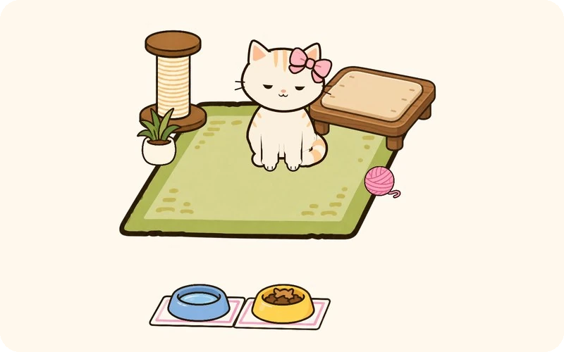
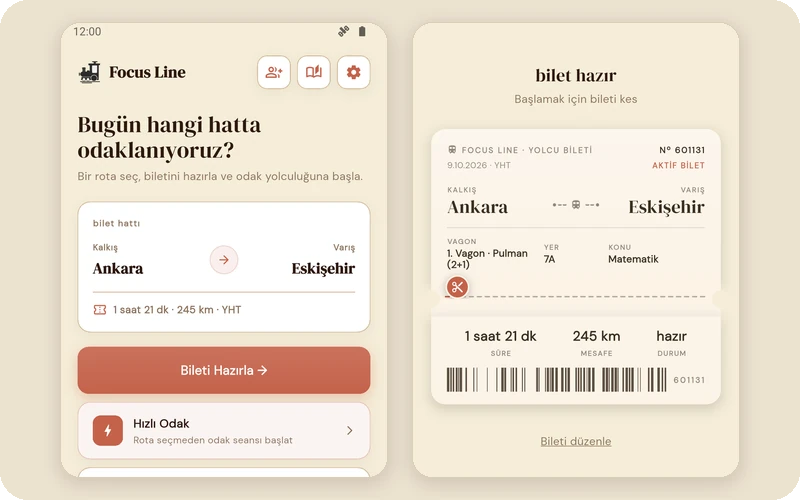
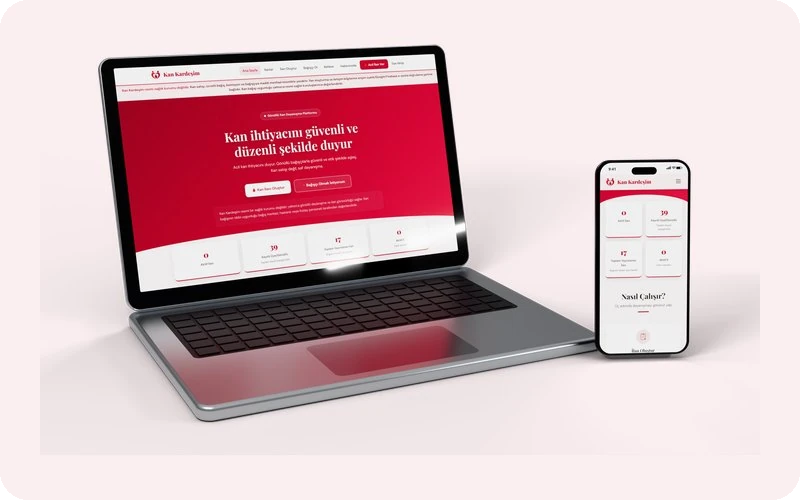
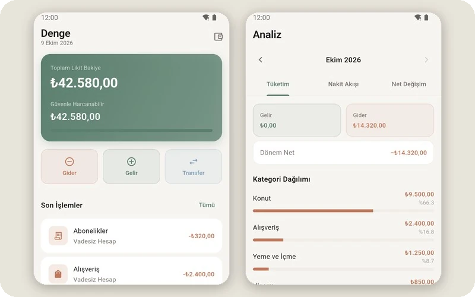
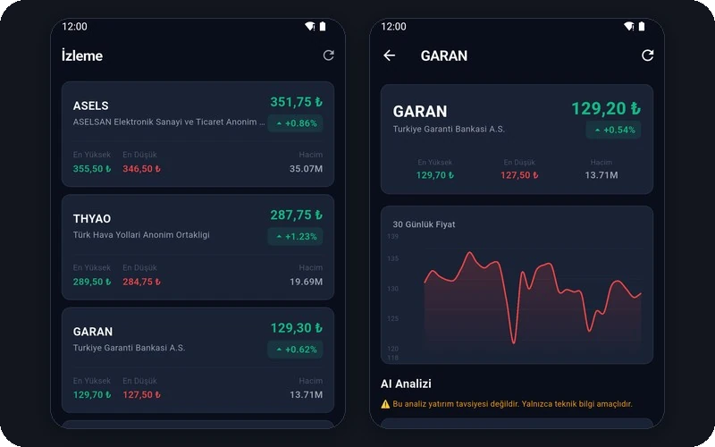
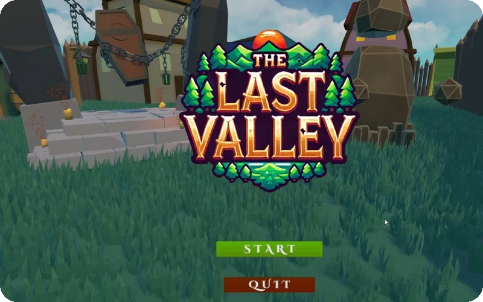

 

   

 

Ankara Üniversitesi Bilgisayar Mühendisliği 3. sınıf öğrencisiyim. Çoğunlukla Flutter ile mobil uygulama yazıyorum; arada web siteleri ve Unity'de oyunlar da yapıyorum.

[PIAV Studio](https://piav.com.tr/)'yu Yusuf Tarlak'la birlikte yürütüyoruz.
 

## Projeler

<table>
  <tr>
    <td width="50%" valign="top">
      
      <h3>Patigo</h3>
      Adım atmayı oyunlaştıran bir sanal kedi uygulaması. Yürüdükçe PatiCoin kazanıyorsun, kediyi besleyip odasını döşüyorsun. Kedinin ruh hali de o gün ne kadar yürüdüğüne göre değişiyor.
        Flutter · Health Connect · three.js
    </td>
    <td width="50%" valign="top">
      
      <h3>Focus Line</h3>
      Ders çalışmayı tren yolculuğuna çeviren bir odak sayacı. Gerçek bir hat seçip biletini alıyorsun, yolculuk süresince çalışıyorsun ve tren haritada ilerliyor. Arkadaşlarınla aynı kompartımanda birlikte de çalışabiliyorsun.
        Flutter · Hive · Supabase
    </td>
  </tr>
  <tr>
    <td width="50%" valign="top">
      
      <h3>Kan Kardeşim</h3>
      Acil kan ihtiyacı olanlarla gönüllü bağışçıları buluşturan sosyal sorumluluk platformu. Yusuf Tarlak'la birlikte yürütüyoruz.
        Vite · Firebase · <a href="https://kankardesim.org.tr/#home">kankardesim.org.tr</a>
    </td>
    <td width="50%" valign="top">
      
      <h3>Denge</h3>
      Kişisel bütçe uygulaması. Kredi kartı ekstrelerini ve taksitleri hesaba katıp bu ay gerçekte ne kadar harcayabileceğini gösteriyor.
        Flutter · Drift · şifreli SQLite
    </td>
  </tr>
  <tr>
    <td width="50%" valign="top">
      
      <h3>Borsa Takip</h3>
      BIST hisseleri için izleme listesi, fiyat alarmları ve portföy takibi. RSI, MACD gibi göstergeleri telefonda hesaplayıp hisseler için bir fırsat skoru çıkarıyor.
        Flutter · Hive · WorkManager
    </td>
    <td width="50%" valign="top">
      
      <h3>The Last Valley</h3>
      Oyun ve Uygulama Akademisi'nde 5 kişilik ekiple bir ayda yaptığımız 3D, çok oyunculu bir RPG. Savaşçı, okçu ve büyücü sınıflarıyla birlikte vadinin lanetini kaldırmaya çalışıyorsunuz. Ekipte Scrum Master'dım.
        Unity · C# · <a href="https://github.com/CodewithFey/TheLastValley-OUA">GitHub</a> · <a href="https://www.youtube.com/watch?v=M78SxntTY2c">tanıtım videosu</a>
    </td>
  </tr>
</table>

### Diğerleri

- [PIAV Tools](https://piav.com.tr/piavtools): tarayıcıda çalışan PDF ve QR araçları
- [Pyrachild](https://github.com/CodewithFey/pyrachild): OUA Game Jam'de 48 saatte ekiple yaptığımız aksiyon oyunu
- [PathMentor](https://github.com/CodewithFey/Bootcamp68-YZTA): YZTA Bootcamp'te CV'den kişisel öğrenme planı çıkaran uygulama
- [Programlama Dilleri Kavramları notları](https://codewithfey.github.io/Programlama-dili-kavramlari-notlar-/): dersin çıkmış soruları ve konu anlatımları
- [Uydu Bilgi Uygulaması](https://github.com/CodewithFey/UydularBilgiUygulamasi): Kodluyoruz Hi-Kod 2.0 bitirme projesi
- [Süpermarket Yönetim Sistemi](https://github.com/CodewithFey/supermarket-yonetim-sistemi): Veritabanı Yönetim Sistemleri dersi için süpermarket zinciri veritabanı ve ER diyagramı

 

## Deneyim

**DenizBank** · Stajyer, Denizaşırı Online Staj Programı (2024)

**Yapay Zeka ve Teknoloji Akademisi**
- Tutor: yeni katılımcıların programa alışmasına yardım ettim, online bir buluşmada sorularını yanıtladım
- Bootcamp: PathMentor ekibinde Scrum Master
- Datathon 2025: [136 takım arasında 4.](https://www.kaggle.com/competitions/academy2025/leaderboard)

**GİRVAK** · Challenger, 2025–2026

**Oyun ve Uygulama Akademisi** · Trainee; The Last Valley ve Pyrachild ekiplerinde

**Kodluyoruz Hi-Kod 2.0** · Flutter &nbsp;&nbsp; **Global AI Hub** · Akbank Python Bootcamp

### Topluluklar

- **Ankara University Computer Society** · Yönetim kurulu üyesi
- **Hacettepe Üniversitesi Yapay Zeka Topluluğu** · Eğitim koordinatörü, kurumsal ilişkiler
- **ACM Hacettepe** · Teknik etkinlik ekibi
- **Etkin Kampüs** · Kampüs temsilcisi

 

## Kullandıklarım

 

<picture>
  <source media="(prefers-color-scheme: dark)" srcset="https://raw.githubusercontent.com/CodewithFey/CodewithFey/output/snake-dark.svg">
  
</picture>

İş birliği için: piavstudioo@gmail.com

