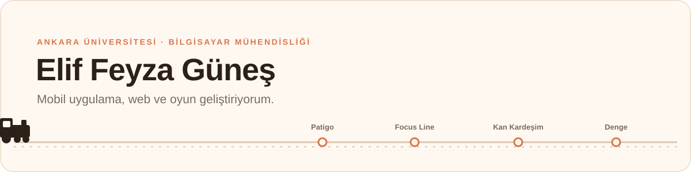
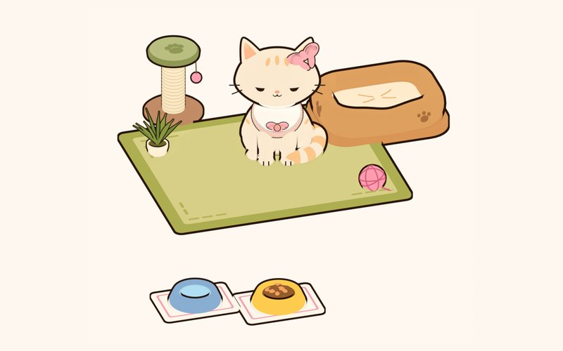
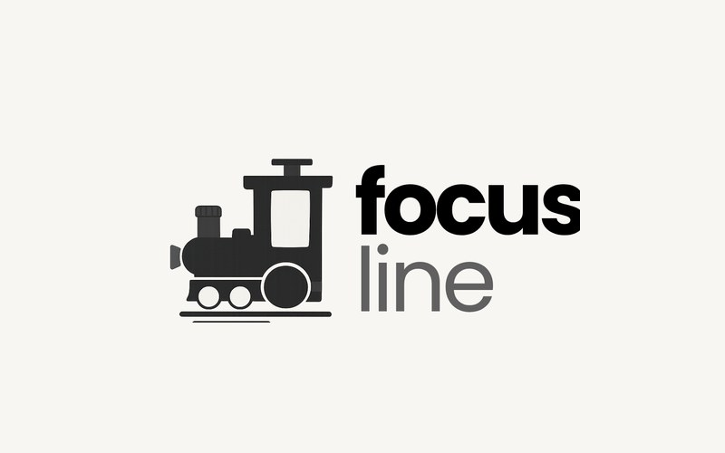
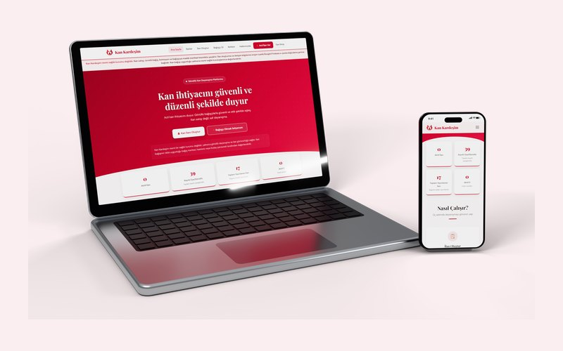
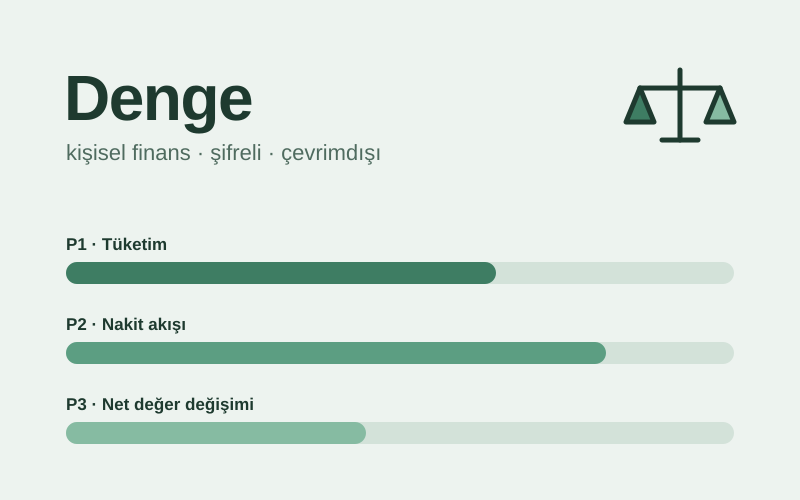
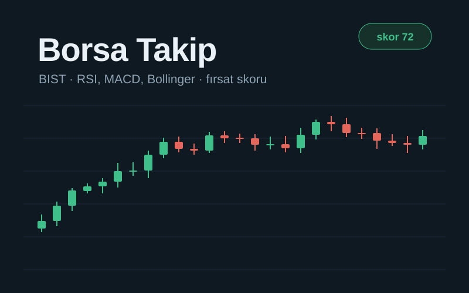
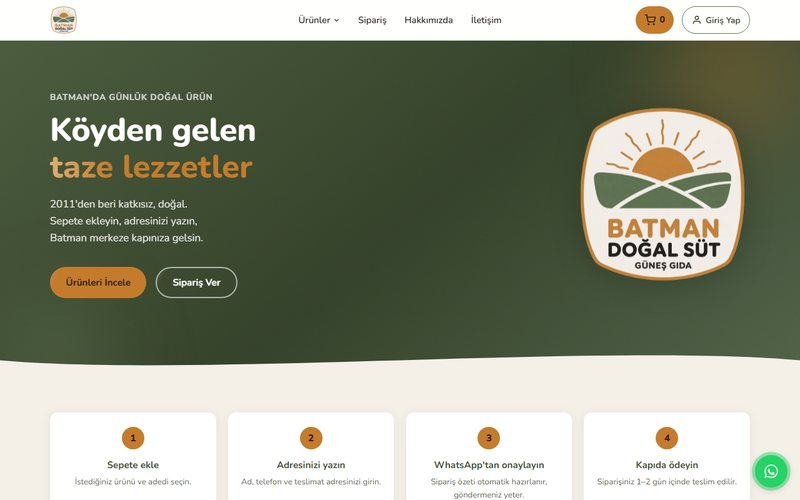

<picture>
  <source media="(prefers-color-scheme: dark)" srcset="assets/banner-dark.svg">
  
</picture>

Merhaba, ben Feyza. Ankara Üniversitesi Bilgisayar Mühendisliği 3. sınıftayım.

Mobil uygulamalar, web siteleri ve arada oyunlar yapıyorum. Aklıma gelen bir fikri baştan sona çalışan bir ürüne çevirmeyi seviyorum; bunların bir kısmını [PIAV Studio](https://piav.com.tr) adıyla Yusuf Tarlak'la birlikte yayınlıyoruz.

Son bir yıldır çoğunlukla Flutter ile mobil uygulama yazıyorum. Vaktimin büyük kısmı ekranda görünmeyen yerlere gidiyor: telefon adım sayarı arka planda kapatmasın, seri gece yarısı bozulmasın, veritabanı şifreli kalsın gibi. Bu dönem yapay zekâ ve veri tarafına daha çok zaman ayırıyorum.

## Projeler

<table>
  <tr>
    <td width="50%" valign="top">
      
      <h3><a href="https://github.com/CodewithFey/patigo3d">Patigo</a></h3>
      Adım sayarlı sanal kedi. Yürüdükçe coin kazanıp kedinin odasını döşüyorsun, kedinin ruh hali de o gün ne kadar yürüdüğüne göre değişiyor. Kedi three.js ile 3D çiziliyor. Play Store yayınına hazırlanıyor.
        Flutter · Riverpod · Health Connect · three.js · Firebase Crashlytics
    </td>
    <td width="50%" valign="top">
      
      <h3><a href="https://github.com/CodewithFey/tren_focus">Focus Line</a></h3>
      Tren yolculuğu temalı odak sayacı. Gerçek bir TCDD hattı seçiyorsun (Ankara–Eskişehir 81 dk gibi), bilet alıp koltuğunu seçiyorsun ve yolculuk boyunca çalışıyorsun. Arkadaşlarınla aynı kompartımanda birlikte de çalışılabiliyor.
        Flutter · Hive · Supabase · flutter_map
    </td>
  </tr>
  <tr>
    <td width="50%" valign="top">
      
      <h3><a href="https://kankardesim.org">Kan Kardeşim</a></h3>
      Acil kan ihtiyacı ilanlarını gönüllü bağışçılarla buluşturan sosyal sorumluluk platformu. Yusuf Tarlak'la birlikte yürütüyoruz; kodu Yusuf yazdı, ben ürün, içerik ve sosyal medya tarafındayım.
        Vite · Firebase Auth · Firestore · Cloudflare Pages · kaynak kodu kapalı
    </td>
    <td width="50%" valign="top">
      
      <h3><a href="https://github.com/CodewithFey/denge">Denge</a></h3>
      Kişisel bütçe uygulaması. Veriler telefonda, şifreli bir SQLite veritabanında duruyor. Kredi kartı ekstrelerini hesaba katıp "bu ay gerçekten ne kadar harcayabilirim" sorusuna cevap veriyor.
        Flutter · Drift · SQLite3MultipleCiphers · Riverpod
    </td>
  </tr>
  <tr>
    <td width="50%" valign="top">
      
      <h3><a href="https://github.com/CodewithFey/borsa">Borsa Takip</a></h3>
      BIST hisseleri için izleme listesi, alarm ve portföy uygulaması. RSI, MACD, Bollinger gibi göstergeleri cihazda hesaplayıp 0–100 arası bir fırsat/risk skoru çıkarıyor.
        Flutter · Hive · WorkManager · ana ekran widget'ları
    </td>
    <td width="50%" valign="top">
      
      <h3><a href="https://batmandogalsut.com.tr">Batman Doğal Süt</a></h3>
      Batman'da süt, peynir ve köy yumurtası satan Güneş Gıda için yaptığım sipariş sitesi. Sepet hazır bir WhatsApp mesajına dönüşüyor. Üyelik, yönetim paneli ve e-posta ile sipariş bildirimi de var.
        HTML/CSS/JS · Firebase · Google Apps Script · kaynak kodu kapalı
    </td>
  </tr>
</table>

**Diğerleri**

- [PIAV Studio](https://piav.com.tr) ve [PIAV Tools](https://piav.com.tr/piavtools): stüdyonun sitesi ve tarayıcıda çalışan PDF/QR araçları
- [Programlama Dilleri Kavramları notları](https://codewithfey.github.io/Programlama-dili-kavramlari-notlar-/): dersin çıkmış sorularını ve konu anlatımlarını topladığım çalışma sitesi
- [PathMentor](https://github.com/CodewithFey/Bootcamp68-YZTA): YZTA Bootcamp'te 5 kişilik ekiple yaptığımız, CV'den kişisel öğrenme planı çıkaran uygulama (Scrum Master'dım)
- [Uydu Bilgi Uygulaması](https://github.com/CodewithFey/UydularBilgiUygulamasi): Kodluyoruz Hi-Kod 2.0 bitirme projesi, Türk uyduları ve quiz
- [The Last Valley](https://github.com/CodewithFey/TheLastValley-OUA): Oyun ve Uygulama Akademisi'nde 5 kişilik ekiple Unity'de yaptığımız 3D, çok oyunculu bir RPG (Scrum Master'dım, [tanıtım videosu](https://www.youtube.com/watch?v=M78SxntTY2c))
- [AnkaraJam](https://github.com/CodewithFey/AnkaraJam): game jam'de ekiple Unity'de yaptığımız 2D oyun

## Yarışmalar ve programlar

- **YZTA Datathon 2025:** Kaggle üzerinde market verisinden ürün fiyatı tahmini. Grup-11 olarak 136 takım arasında 4. olduk. [Final sıralaması](assets/datathon-siralama.png) (yarışma sayfası gizli olduğu için ekran görüntüsü)
- **Yapay Zeka ve Teknoloji Akademisi (YZTA) Bootcamp:** PathMentor ekibinde Scrum Master
- **Oyun ve Uygulama Akademisi (OUA):** The Last Valley ekibinde Scrum Master
- **Kodluyoruz Hi-Kod 2.0:** Flutter bootcamp'i, bitirme projesi
- **Global AI Hub:** Python eğitimi, proje olarak [kütüphane yönetim sistemi](https://github.com/CodewithFey/LMS)

## Kullandıklarım

  

## İletişim

[LinkedIn](https://linkedin.com/in/elif-feyza-gunes) · [piavstudioo@gmail.com](mailto:piavstudioo@gmail.com) · [piav.com.tr](https://piav.com.tr) · [Instagram](https://www.instagram.com/piavstudio/)

<picture>
  <source media="(prefers-color-scheme: dark)" srcset="https://raw.githubusercontent.com/CodewithFey/CodewithFey/output/snake-dark.svg">
  
</picture>
